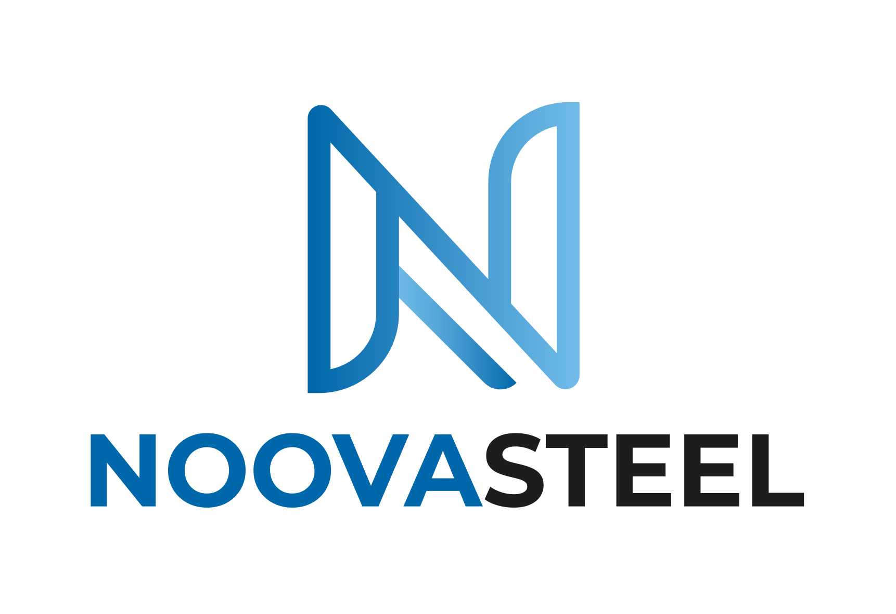

# NOOVADO JSC · 株式会社Noovado

**デジタル変革を通じて社会の進歩を創造する**
*Creating societal progress through digital transformation*

[www.noovado.com](https://www.noovado.com) · [contact@noovado.com](mailto:contact@noovado.com)

---

## 会社概要 · About us

株式会社Noovado（NOOVADO JSC）は、ベトナムのソフトウェア開発会社です。Web・アプリ・AI・ブロックチェーン分野における開発を、企画から運用までワンストップで提供しています。NOOVADO HOLDINGS グループの一員として、建設・ものづくり分野のグループ会社と共に、日本とベトナムのお客様を支えています。

NOOVADO JSC (株式会社Noovado) is a software development company in Vietnam. We deliver web, mobile, AI and blockchain development as a one-stop service, from planning to operation. As part of the NOOVADO HOLDINGS group, we work alongside our sister companies in construction and manufacturing to support customers in Japan and Vietnam.

## 事業内容 · What we do

| 事業 · Service | 内容 · Description |
|---|---|
| **Web開発** · Web development | パフォーマンスとスケーラビリティに優れたWebアプリケーション Responsive web applications built for performance and scalability |
| **モバイル開発** · Mobile development | iOS・Androidアプリの開発 Apps for iOS and Android |
| **ITコンサルティング** · IT consulting | 企画フェーズからシステムの全体像の可視化まで From the planning phase to a clear picture of the whole system |
| **AI・データサイエンス** · AI & data science | 業務に活かすデータ分析とAI機能 Data analysis and AI features for business |
| **ブロックチェーン** · Blockchain | スマートコントラクトとWeb3アプリケーション Smart contracts and Web3 applications |
| **ゲーム開発** · Game development | ゲーム・インタラクティブアプリケーション Games and interactive applications |

**技術 · Technologies**

`React` `Vue.js` `JavaScript` `Node.js` `PHP` `Ruby on Rails` `Python` `Go` `Java` `C#` `.NET` `Swift` `iOS` `Android`

## NOOVADO HOLDINGS グループ · Group companies

NOOVADO HOLDINGS は、日本とベトナムを拠点とするグループです。各社がそれぞれの専門分野を担っています。
NOOVADO HOLDINGS is a group based in Japan and Vietnam. Each company covers its own field.

### NOOVADO JSC · 株式会社Noovado — ベトナム · Vietnam
Web・アプリ・AI・ブロックチェーン分野における開発をワンストップで提供（ITエンジニア40名）
One-stop development of web, mobile apps, AI and blockchain (40 IT engineers)
[www.noovado.com](https://www.noovado.com)

### NOOVACONS JSC · 株式会社Noovacons — ベトナム · Vietnam
*人と技術の力で、建設業界に新たな未来を。 · People and technology building a new future for the construction industry*

建築・土木・設備分野の設計から施工までを支えるオフショアパートナー（エンジニア30名）
Offshore partner for architecture, civil engineering and building services, from design to construction (30 engineers)

- **CAD図面作成** · CAD drafting — 手書き図面のCAD化、図面修正、施工図展開 · digitising hand drawings, revisions, shop drawings
- **BIM/CIM/MEP** — 建築・構造・設備のBIMモデリング、点群からBIMへの変換、BIMコンテンツ制作 · BIM modelling for architecture, structure and MEP, point cloud to BIM, BIM content
- **シミュレーションと可視化** · Simulation and visualisation — CGパース、VR、バーチャル内覧 · renderings, VR and virtual walkthroughs
- **ソフトウェア開発** · Software development — Archicad・AutoCAD・Revit・Tekla等のカスタマイズ、業務効率化Webシステム、現場支援モバイルシステム · add-ins for Archicad, AutoCAD, Revit and Tekla, web systems for efficiency, mobile apps for the site

[www.noovacons.com](https://www.noovacons.com)

### NOOVAMECH JSC · ノーバメック — ベトナム · Vietnam
*人と技術の力で、ものづくりに新たな未来を · People and technology building a new future for manufacturing*

機械・治具・電気制御設計・製作をワンストップで提供（機械エンジニア25名）
One-stop design and manufacturing of machines, jigs and electrical control (25 mechanical engineers)

- **機械設計** · Mechanical design — 2D・3D CADによるエンジン関連製品、加工・組付・溶接設備の設計 · engine-related products and machining, assembly and welding equipment in 2D/3D CAD
- **電気設計** · Electrical design — 制御回路設計から制御盤設計まで · from control circuits to control panels
- **製作** · Manufacturing — 部品調達から組立まで、ベトナム工場でのユニット製品製作 · from parts sourcing to assembly of unit products in our Vietnam factory
- **ソフトウェア開発** · Software development — 機械系CADのカスタマイズ、業務効率化システム · mechanical CAD customisation and efficiency systems

[www.noovamech.com](https://www.noovamech.com)

### NOOVASTEEL JSC — ベトナム · Vietnam
*人と技術の力で、鉄骨づくりに新たな価値を · People and technology creating new value in steel construction*

鉄骨構造の図面作成から製作管理まで、日本の鉄骨工事を支えるパートナー
Partner for Japanese steel construction, from steel structure drawings to fabrication management

- **鉄骨図面作成** · Steel structure drawings — BIM・CADを用いて設計段階から製作・施工まで · BIM and CAD drawings from design through fabrication and erection
- **鉄骨製作・管理** · Fabrication management — ベトナムの協力工場と連携した製作管理、品質管理、検査、物流 · manufacturing oversight, quality control, inspection and logistics with partner factories in Vietnam
- **システム開発** · System development — BIM・AI・デジタル技術を活用した自動化と効率化 · automation and efficiency with BIM, AI and digital tools
- **人材育成** · Engineer training — 日本の鉄骨技術・日本語・品質基準を学ぶベトナム人技術者の育成 · training Vietnamese engineers in Japanese steel fabrication, language and quality standards

[www.noovasteel.com](https://www.noovasteel.com)

### NOOVADO JAPAN · 合同会社Noovado Japan — 日本 · Japan
日本のお客様との契約および窓口機能を担っています
Contracts and the point of contact for customers in Japan

[www.noovado.co.jp](https://www.noovado.co.jp)

## お問い合わせ · Contact

[contact@noovado.com](mailto:contact@noovado.com) · [グループ概要 · Group overview](https://noovado.co.jp/holdings/)
